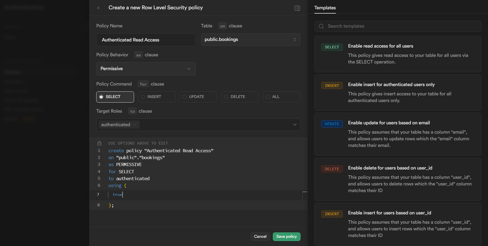

<a name="readme-top"></a>

<!-- PROJECT LOGO -->
<br />
<div align="center">
  <a href="https://staymanager.netlify.app">
    
  </a>

  <p align="center">
   An open-source, zero-cost accommodation management solution
  </p>
    <a href="https://staymanager.netlify.app">View Demo</a>
    ·
    <a href="https://github.com/TusharGaonkar/Stay-Manager/issues/new">Report Bug</a>
    ·
    <a href="https://github.com/TusharGaonkar/Stay-Manager/issues/new">Request Feature</a>
  </p>
  
</div>

<!-- ABOUT THE PROJECT -->

## About The Project

Stay Manager is an open-source, zero-cost accommodation management solution crafted for small and medium businesses venturing into the accommodation sector. Built on Supabase, it offers a reliable and scalable platform to effortlessly manage reservations, guest check-ins/check-outs, room assignments, and more. With its intuitive interface and user-friendly design, Stay Manager streamlines your operations, enabling you to provide exceptional guest experiences.

<p align="right">(<a href="#readme-top">back to top</a>)</p>

### Built With

Tech stack of `Stay Manager(v-1.0.0)`

[](https://www.typescriptlang.org/)
[](https://reactjs.org/)
[](https://github.com/shadcn/ui)
[](https://tailwindcss.com/)
[](https://recharts.org/)
[](https://react-query.tanstack.com/)
[](https://github.com/colinhacks/zod)
[](https://react-hook-form.com/)
[](https://www.postgresql.org/)
[](https://supabase.io/)

<p align="right">(<a href="#readme-top">back to top</a>)</p>

<!-- GETTING STARTED -->

## Getting Started

### Prerequisites

Before you begin, make sure you have the following prerequisites:

- [Node.js](https://nodejs.org/) version 20 or greater installed on your system.
- [Supabase](https://supabase.io/) account.

### Installation

1. Clone the repository by running the following command in your terminal or command prompt:

```sh
git clone https://github.com/TusharGaonkar/Stay-Manager.git
```

2.Navigate to the cloned repository

```sh
cd Stay-Manager
```

3.Install the dependencies

```sh
npm install
```

### Setting up the Backend

1. Create a Supabase project with name `Stay Manager`

   [](https://supabase.com/)


2. Copy the project key and URL from the console


- Open the `.env.txt` file in the root directory of the project.
- Replace the placeholder values in the file:

```sh
VITE_SUPABASE_KEY = 'YOUR_SUPABASE_KEY'

VITE_SUPABASE_URL = 'YOUR_SUPABASE_URL'

VITE_CURRENCY_LOCALE = "en-IN"

VITE_CURRENCY = "INR"
```

To view all the supported `VITE_CURRENCY_FORMAT` values, check [here](https://gist.github.com/ncreated/9934896)

To view all the supported `VITE_CURRENCY` values, check [here](https://www.iban.com/currency-codes)

- Rename the `.env.txt` file to `.env`
- **Important**: Do not share your `.env` file with anyone as it contains sensitive information.

<p align="right">(<a href="#readme-top">back to top</a>)</p>

3. Creating Storage Bucket

- Click on `Storage` from the sidebar.
- Create a new Supabase storage with the name`rooms`


### Creating Tables and PostgreSQL Functions

- Navigate to the SQL Editor in the sidebar.
- Create two queries named `Functions` and `Tables`
- Copy the queries from [Functions.sql](setup/Functions.sql) and paste it into the `Functions` query editor.
- Copy the content of the [Tables.sql](/setup/Tables.sql) and paste it into the `Tables` query editor.
- Click on the `Run` button to execute the queries


### Adding Authentication

- From the sidebar, select `Authentication`
- Click on `Add user`


- Provide an admin `email` and `password`


- Follow any additional steps or prompts to complete the authentication setup

### Configuring Reset Password

- Click on the `Email Templates` tab in the sidebar in `Authentication`
- Move to `Reset password` tab
- Replace the `Source` with with the following message body and save it

```html
<h2>Reset Your Stay Manager Password</h2>
<p>This is a one-time sign-in link for your account. Follow this URL to reset the password:</p>
<p>
  Go to <strong>Settings</strong>, then in the <strong>Account Settings</strong>, update your
  password!
</p>
<p><a href="{{ .ConfirmationURL }}">Reset Password</a></p>
```


### Enabling Row Level Security (RLS)

In order to enable Row Level Security (RLS), to prevent unauthorized access to data, you need to create policies for each of the methods

- Navigate to `Authentication`
- Go to `Policies`
- Click on `Create policy` on the table
- For each of the methods `SELECT`, `INSERT`, `UPDATE`, `DELETE`,
  create the policies for the target role of `authenticated` as shown below and save the policies individually

`SELECT` Policy



`INSERT` Policy


`UPDATE` Policy


`DELETE` Policy


- Once all the policies are created, click on `Enable RLS`


- **Repeat the steps for all the tables**

### Running the server locally

To run the server locally, follow these steps:

- Navigate to the root directory of the project.
- Run the following command:

  ```sh
  npm run dev
  ```

- You can access Stay Manager at `localhost:5173`

- Login with your admin credentials, try adding a new room and new booking for yourself and see the changes live in real-time

- Once you have verified the setup is working, it's time to deploy the project

### Deploying Stay Manager

- To build manually and preview use

```sh
npm run build && npm run preview
```

The build files will be located in the `/dist` folder, and the app will be live at `localhost:4173`

Create a remote Github repository for your local Stay Manager setup

### Deploying to Netlify

[](https://netlify.com)

- To deploy to Netlify from Github please refer this [doc](https://docs.netlify.com/site-deploys/create-deploys/)
- Remember to add entries for all the environment variables in your build configuration settings

### Deploying to Vercel

[](https://vercel.com)

- To deploy to Vercel please refer this [doc](https://vercel.com/docs/deployments/git/vercel-for-github)

- Rename the `/api` folder to `supabase-api` or similar other than `api` if you get the following error message

`Error: No more than 12 Serverless Functions can be added to a Deployment on the Hobby plan. Create a team (Pro plan) to deploy more`.

as Vercel treats all the files inside the `/api` folder as Serverless Functions.

- After renaming, enable your IDE to automatically update the paths in the current files importing functions from the `/api` folder

- Remember to add entries for all the environment variables in your build configuration settings

<p align="right">(<a href="#readme-top">back to top</a>)</p>

## Configuring the Domain in Supabase console

- Navigate to `Authentication` in your Supabase project
- From the sidebar, select `URL Configuration`
- Enter your domain name in the `Site URL` field, here our domain is `staymanager.netlify.app`


<p align="right">(<a href="#readme-top">back to top</a>)</p>

Done! you have successfully deployed your own Stay Manager instance ⚡👏.

## Contributing

If you have a suggestion that would make this better, please fork the repo and create a pull request.

1. Fork the Project
2. Create your Feature Branch (`git checkout -b feature/AmazingFeature`)
3. Commit your Changes (`git commit -m 'Add some AmazingFeature'`)
4. Push to the Branch (`git push origin feature/AmazingFeature`)
5. Open a Pull Request

<p align="right">(<a href="#readme-top">back to top</a>)</p>

## Contact

Feel free to reach out if you have any queries or suggestions to improve👍

Tushar Gaonkar - gaonkar.tushar01@gmail.com
